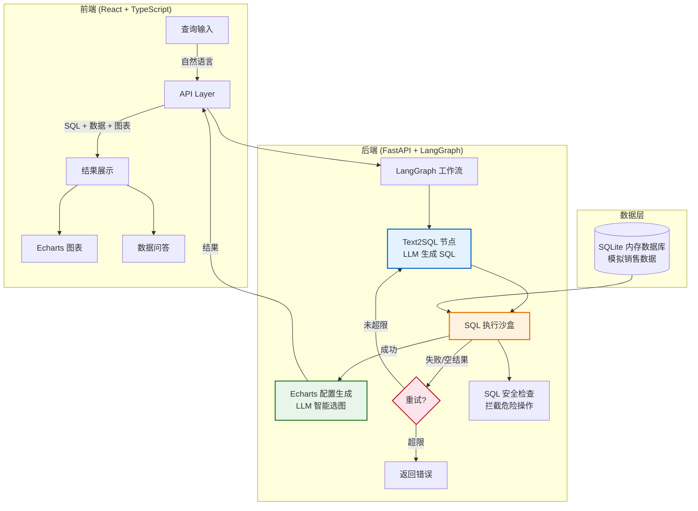

<div align="center">

# 🧠 NL2BI

### 基于 Multi-Agent 架构的自然语言智能数据分析系统

[](https://www.python.org/)
[](https://fastapi.tiangolo.com/)
[](https://langchain-ai.github.io/langgraph/)
[](https://react.dev/)
[](https://www.typescriptlang.org/)
[](https://echarts.apache.org/)
[](LICENSE)

</div>

---

## 📖 项目简介

NL2BI 是一个**智能数据分析系统**，用户只需用自然语言描述需求，系统自动完成 SQL 生成、数据查询、图表可视化，并支持基于结果的智能追问。

### ✨ 核心特性

- 🤖 **Multi-Agent 工作流** - LangGraph 状态机驱动的 Text2SQL → SQL 执行 → 图表生成闭环
- 🧠 **轨迹记忆机制** - 错误历史汇编入 Prompt，让模型反思修正，避免死循环
- 🛡️ **空值拦截** - 检测空结果集，视作业务逻辑幻觉，强制重试（最多 3 次）
- 🎨 **智能图表选择** - LLM 根据数据特征自动选择折线图、柱状图、饼图等
- 💬 **数据问答对话** - 基于查询结果追问细节，支持趋势分析和异常检测
- 📜 **查询历史** - 自动保存查询记录，支持一键回填
- 🔒 **SQL 安全防护** - 只允许 SELECT 查询，拦截危险操作
- ✏️ **SQL 可编辑** - 支持手动修改 SQL 后重新执行，灵活微调查询
- 📊 **图表类型切换** - 一键切换柱状图/折线图/饼图/表格，满足不同分析场景
- 📥 **导出能力** - 支持导出 CSV 数据和图表 PNG 图片

---

## 🏗️ 系统架构



---

## 🔄 工作流详解

### LangGraph 状态机

NL2BI 的核心是一个 **LangGraph 状态机**，包含三个节点和条件边：

| 节点 | 功能 | 输入 | 输出 |
|------|------|------|------|
| Text2SQL | 自然语言转 SQL | 用户查询 + Schema + 错误历史 | SQL 语句 |
| Execute SQL | 执行 SQL 查询 | SQL 语句 | DataFrame / 错误 |
| Generate Echarts | 生成图表配置 | 查询结果数据 | Echarts JSON |

### 轨迹记忆机制

```
第1次尝试: 用户查询 → 生成SQL → 执行失败(空结果)
                                    ↓
第2次尝试: 错误历史 + 用户查询 → 生成SQL → 执行失败
                                              ↓
第3次尝试: 更多错误历史 + 用户查询 → 生成SQL → 执行成功 ✓
```

错误历史被汇编到 Prompt 中，让 LLM 反思之前的错误，逐步修正 SQL。

### 智能图表选择

LLM 根据数据特征自动选择最合适的图表类型：

| 数据特征 | 推荐图表 | 示例 |
|----------|----------|------|
| 时间序列/趋势 | 折线图 (line) | 每月销售趋势 |
| 分类对比 | 柱状图 (bar) | 各地区销售额 |
| 占比/比例 | 饼图 (pie) | 产品类别占比 |
| 两列相关性 | 散点图 (scatter) | 价格 vs 销量 |

---

## 🛠️ 技术栈

### 后端

| 技术 | 用途 |
|------|------|
| Python 3.11+ | 主语言 |
| FastAPI | Web 框架 |
| LangGraph | Agent 工作流引擎 |
| langchain-openai | LLM 调用 |
| SQLite | 内存数据库 |
| Pandas | 数据处理 |
| uv | 包管理器 |

### 前端

| 技术 | 用途 |
|------|------|
| React 18 | UI 框架 |
| TypeScript | 类型安全 |
| Vite | 构建工具 |
| TailwindCSS | 样式框架 |
| Echarts | 图表可视化 |

---

## 🚀 快速开始

### 前置要求

- Python 3.11+
- Node.js 18+
- [uv](https://github.com/astral-sh/uv) 包管理器（启动脚本会自动安装）
- OpenAI 兼容的 API Key

### 1. 克隆项目

```bash
git clone git@github.com:xt-fg/nl2bi.git
cd nl2bi
```

### 2. 配置环境变量

```bash
cp backend/.env.example backend/.env
```

编辑 `backend/.env`，填入你的 API Key：

```env
OPENAI_API_KEY=your-api-key-here
OPENAI_API_BASE=https://api.openai.com/v1
OPENAI_MODEL=gpt-4o-mini
```

### 3. 一键启动

```bash
chmod +x start.sh
./start.sh
```

启动脚本会自动：
- ✅ 检查并安装 uv（如缺失）
- ✅ 安装后端 Python 依赖
- ✅ 启动后端服务（端口 8000）
- ✅ 安装前端 Node 依赖
- ✅ 启动前端服务（端口 5173）

启动成功后输出：

```
=== NL2BI 系统已启动 ===
后端服务: http://localhost:8000
前端界面: http://localhost:5173
API 文档: http://localhost:8000/docs

停止服务:
  kill <PID1> <PID2>
```

### 4. 访问应用

| 地址 | 说明 |
|------|------|
| http://localhost:5173 | 前端界面 |
| http://localhost:8000/docs | API 文档（Swagger） |
| http://localhost:8000/health | 健康检查 |

### 5. 停止服务

```bash
# 方式一：使用启动时输出的 PID
kill <后端PID> <前端PID>

# 方式二：杀掉所有相关进程
pkill -f uvicorn
pkill -f vite
```

---

## 📁 项目结构

```
nl2bi/
├── backend/                        # 后端服务
│   ├── app/
│   │   ├── agent/                 # LangGraph Agent
│   │   │   ├── nodes/             # 工作流节点
│   │   │   │   ├── text2sql.py        # Text2SQL 节点
│   │   │   │   ├── execute_sql.py     # SQL 执行沙盒
│   │   │   │   └── generate_echarts.py # Echarts 配置生成
│   │   │   ├── state.py           # 状态定义（含 errors 列表）
│   │   │   ├── tools.py           # LLM 调用 & 提示模板
│   │   │   └── workflow.py        # 状态机 & 条件边
│   │   ├── api/
│   │   │   └── endpoints.py       # API 路由
│   │   ├── core/
│   │   │   └── config.py          # 配置
│   │   ├── models/
│   │   │   └── schemas.py         # Pydantic 数据模型
│   │   ├── utils/
│   │   │   └── database.py        # SQLite 管理 & 安全检查
│   │   └── main.py                # FastAPI 入口
│   ├── pyproject.toml
│   └── .env.example
├── frontend/                       # 前端应用
│   ├── src/
│   │   ├── components/
│   │   │   ├── QueryInput.tsx     # 查询输入
│   │   │   ├── ResultDisplay.tsx  # 结果展示（SQL + 表格 + 图表）
│   │   │   ├── ChatPanel.tsx      # 数据问答对话
│   │   │   └── QueryHistory.tsx   # 查询历史
│   │   ├── services/
│   │   │   └── api.ts             # API 调用封装
│   │   ├── types/
│   │   │   └── index.ts           # TypeScript 类型
│   │   └── App.tsx                # 主应用
│   └── package.json
├── start.sh                        # 一键启动脚本
├── docker-compose.yml              # Docker 部署配置
└── README.md
```

---

## 📚 API 文档

### 自然语言查询

```http
POST /api/query
Content-Type: application/json

{
  "query": "查询每个地区的销售总额"
}
```

**响应示例：**

```json
{
  "sql": "SELECT region, SUM(amount) AS total_sales FROM sales GROUP BY region",
  "data": [
    {"region": "华东", "total_sales": 1872808.0},
    {"region": "华北", "total_sales": 1728733.0}
  ],
  "echarts_config": {
    "title": {"text": "各区域销售总额对比"},
    "series": [{"type": "bar", "data": [...]}]
  },
  "error": null,
  "execution_time": 12.5,
  "retry_count": 0
}
```

### 数据问答

```http
POST /api/chat
Content-Type: application/json

{
  "message": "这些数据的最大值是多少？",
  "context": {
    "sql": "SELECT ...",
    "data": [...]
  }
}
```

### 获取表信息

```http
GET /api/tables
```

### 获取 Schema

```http
GET /api/schema
```

---

## 🎯 使用示例

### 查询示例

| 自然语言查询 | 系统行为 |
|-------------|----------|
| 查询每个地区的销售总额 | 生成聚合 SQL + 柱状图 |
| 统计每月的销售趋势 | 生成时间序列 SQL + 折线图 |
| 显示各产品类别占比 | 生成分组 SQL + 饼图 |
| 销售额前10的产品 | 生成排序 SQL + 柱状图 |

### 追问示例

查询完成后，可以基于结果追问：

- "这些数据的最大值/最小值是多少？"
- "有什么异常值吗？"
- "请总结一下这些数据的趋势"
- "哪个区域表现最好？为什么？"

---

## ⚙️ 环境变量

| 变量名 | 说明 | 默认值 |
|--------|------|--------|
| `OPENAI_API_KEY` | API 密钥 | （必填） |
| `OPENAI_API_BASE` | API 基础 URL | `https://api.openai.com/v1` |
| `OPENAI_MODEL` | 模型名称 | `gpt-4o-mini` |
| `APP_PORT` | 后端端口 | `8000` |
| `DEBUG` | 调试模式 | `True` |
| `MAX_RETRIES` | 最大重试次数 | `3` |

---

## 🐳 Docker 部署

```bash
# 配置环境变量
cp backend/.env.example backend/.env
# 编辑 backend/.env 填入 API Key

# 启动
docker-compose up -d

# 访问
# 前端: http://localhost:5173
# 后端: http://localhost:8000
```

---

## ❓ 常见问题

**Q: 启动报错 `OPENAI_API_KEY is not set`**

A: 检查 `backend/.env` 文件是否已创建并填入有效的 API Key。

**Q: 前端显示 `Failed to fetch`**

A: 确保后端服务已启动。访问 http://localhost:8000/health 验证。

**Q: 查询返回"图表配置解析失败"**

A: 通常是 LLM 返回的 JSON 格式有问题，系统会自动回退到规则生成的图表。检查后端日志 `/tmp/nl2bi-backend.log` 获取详情。

**Q: SQL 被安全防护拦截**

A: 系统只允许 SELECT 查询。如果需要其他操作，请修改 `backend/app/utils/database.py` 中的 `_check_sql_safety` 方法。

---

## 🤝 贡献

欢迎提交 Issue 和 Pull Request！

1. Fork 本仓库
2. 创建特性分支 (`git checkout -b feature/amazing-feature`)
3. 提交更改 (`git commit -m 'Add amazing feature'`)
4. 推送到分支 (`git push origin feature/amazing-feature`)
5. 开启 Pull Request

---

## 📄 License

本项目采用 MIT License - 详见 [LICENSE](LICENSE) 文件

---

## 🙏 致谢

- [FastAPI](https://fastapi.tiangolo.com/) - 高性能 Python Web 框架
- [LangGraph](https://langchain-ai.github.io/langgraph/) - Agent 工作流引擎
- [LangChain](https://www.langchain.com/) - LLM 应用开发框架
- [React](https://react.dev/) - 用户界面库
- [Echarts](https://echarts.apache.org/) - 数据可视化库
- [TailwindCSS](https://tailwindcss.com/) - CSS 框架

---

<div align="center">

**⭐ 如果这个项目对你有帮助，请给个 Star！⭐**

</div>
